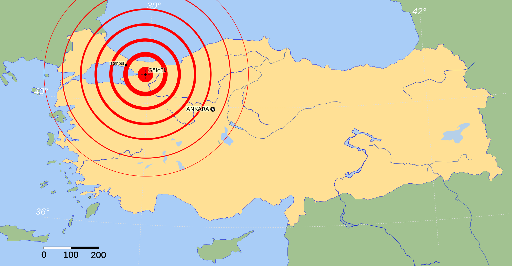

# Leaflet Maps Earthquakes

Analysis of last weeks earthquakes and relation between tectonic plates.

Data Sources:
- USGS
-  http://peterbird.name/oldFTP/PB2002/

Data File Description:
- index.html: Template to show leaflet map.
- logic.html: Logic to read data (using d3.json), create leaflet objects, maps and controls.
- style.css: Stylesheet to customize some details.
